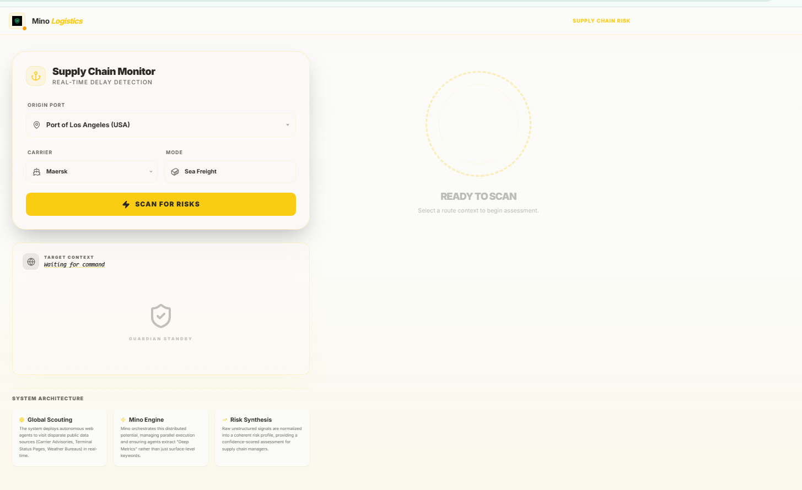
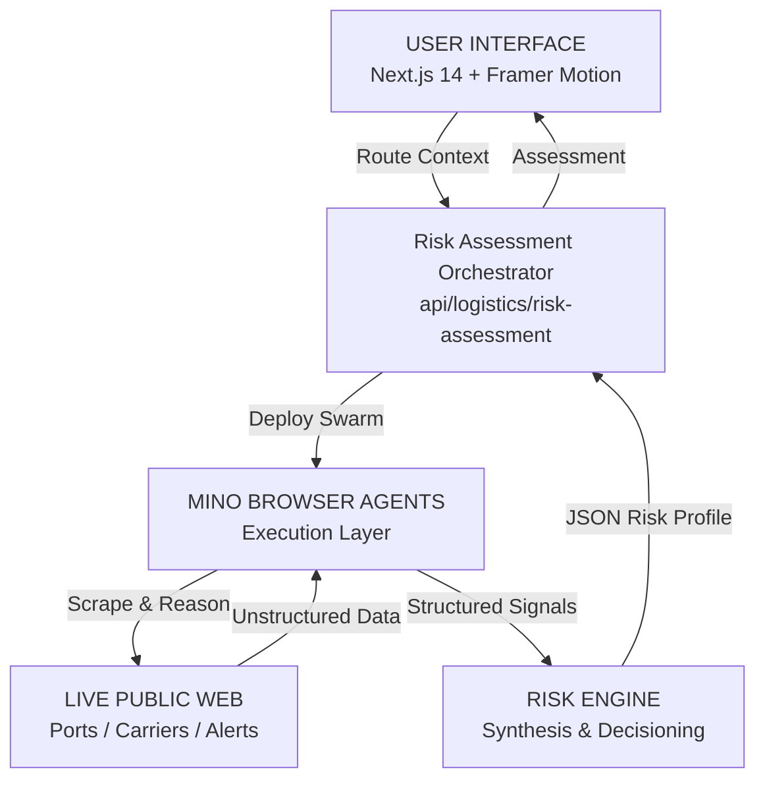

# Logistics Sentry — Autonomous Real-Time Risk Monitor

## Overview
**Logistics Sentry** is a next-generation supply chain visibility tool that uses the **Mino API** to deploy autonomous web agents. These agents "scout" live public data sources—such as port authority updates, carrier advisories, and maritime terminal statuses—to detect operational risks and delays that traditional static APIs often miss.

---

### 🖥️ System Preview


---

## 1. Goal (Intelligence Lifecycle)
The system acts as an expert logistics researcher. Its goal is to provide real-time, source-backed operational signals for specific shipment contexts.

**CURRENT SYSTEM TIME:** Friday, January 17, 2026, 18:25 PM

### 🔍 Scouting Process

| Phase | Action |
| :--- | :--- |
| **DISCOVERY** | Map the shipment context (Origin Port + Carrier) to a dynamic list of intelligence targets (e.g., Port of LA operations page). |
| **SCOUTING** | Deploy parallel **Mino Agents** to navigate the live DOM of target websites and extract "Deep Metrics". |
| **SIGNAL EXTRACTION** | Identify specific wait times, gate turn times, vessel counts, or service alerts from unstructured web content. |
| **SYNTHESIS** | Normalize raw signals into a structured **Risk Profile** with a confidence-scored assessment and recommended action. |

### 📄 Output Schema
```json
{
  "shipment_context": {
    "origin_port": "Port of Los Angeles",
    "carrier": "Maersk",
    "mode": "Sea Freight"
  },
  "risk_assessment": {
    "delay_risk": "HIGH",
    "primary_cause": "CONGESTION + LABOR",
    "confidence": 0.85
  },
  "signals_detected": [
    {
      "source": "Port Authority",
      "signal": "Wait time: 3 days. Anchored vessels: 12.",
      "severity": "HIGH",
      "date": "2026-01-17"
    }
  ],
  "recommended_action": "CRITICAL: Divert cargo immediately. Labor action confirmed."
}
```

---

## 2. Code Snippets

### cURL
```bash
curl -X POST "http://localhost:3000/api/logistics/risk-assessment" \
  -H "Content-Type: application/json" \
  -d '{
    "origin_port": "Shanghai",
    "carrier": "MSC",
    "mode": "Sea Freight"
  }'
```

### TypeScript (Frontend Component)
```typescript
const response = await fetch("/api/logistics/risk-assessment", {
  method: "POST",
  headers: { "Content-Type": "application/json" },
  body: JSON.stringify({
    origin_port: "Rotterdam",
    carrier: "CMA CGM",
    mode: "Sea Freight"
  }),
});

const data = await response.json();

if (data.risk_assessment) {
  setResult(data);
  toast({ title: "Scan Complete", description: "All signals synthesized." });
}
```

### Python (SDK Usage)
```python
import requests

def assess_risk(port, carrier):
    url = "http://localhost:3000/api/logistics/risk-assessment"
    payload = {"origin_port": port, "carrier": carrier}
    
    response = requests.post(url, json=payload)
    data = response.json()
    
    risk = data['risk_assessment']['delay_risk']
    print(f"Current Risk for {port}: {risk}")
    print(f"Action: {data['recommended_action']}")

assess_risk("Port of Los Angeles", "Maersk")
```

---

## 3. Operational Signals
As the agents browse, the UI displays real-time status updates:

```text
Logistics Scout: Analyzing Port of LA - Operations Updates...
Logistics Scout: Reading MarineTraffic - Port Congestion (LA)...
Logistics Scout: Scouting Maersk Network Advisories...
Intelligence Engine: Aggregating 3 signals for Port of Los Angeles / Maersk...
System Activity: High risk detected. Generating recommendation...
```

---

## 🛠 Key Features

| Feature | Description |
| :--- | :--- |
| **Parallel Scouting** | Launches multiple agents simultaneously to analyze port authorities and carriers in seconds. |
| **Deep Metric Extraction** | Agents extract quantitative data (wait times, vessel counts) rather than just keywords. |
| **Network Scan Visualizer** | A high-fidelity UI component showing the agent's real-time reasoning and navigation steps. |
| **Custom Context Input** | Allows users to specify preset routes or enter custom ports and carriers for targeted scouting. |

---

## 🏗 Architecture Overview



### Component Relationships

| Component | Role | Logic |
| :--- | :--- | :--- |
| **LogisticsDashboard** | Core page component managing input state and result rendering | `src/app/page.js` |
| **MinoAgentAesthetics** | Visual swarm animation showing active scouting nodes | `src/components/MinoAgentAesthetics.js` |
| **Logistics Agent** | Handles source discovery and parallel agent execution | `src/lib/logistics/agent.js` |
| **Mino Core** | Underlying SDK for autonomous browser navigation | `src/lib/mino.js` |

---

## 🔄 Data Flow
1. **Context Entry** → User picks or enters an Origin Port and Carrier (e.g., *"Port of LA"* + *"Maersk"*).
2. **Source Discovery** → The Orchestrator maps the context to specific target URLs for scouting.
3. **Agent Dispatch** → Parallel **Mino Agents** navigate to the target URLs to extract metrics.
4. **Autonomous Reasoning** → Agents read the DOM, identify alerts, and extract "Operational Signals."
5. **Synthesis** → The Risk Engine weighs signals (Congestion, Labor, Weather) to determine a Risk Level.
6. **Action Output** → A comprehensive JSON profile is returned, including a recommended business action.

---

## 💡 System Vision

> Build an autonomous supply chain monitor:
> - Deploy a Mino browser agent to browse official port and carrier pages for live verification.
> - Show a transparent "Network Map" of the agent's scouting steps to build trust.
> - Extract "Deep Metrics" rather than surface-level headlines to detect delays early.
> - Synthesize unstructured web data into an actionable, confidence-scored risk profile.
> - Provide clear operational recommendations to mitigate shipment disruptions.
