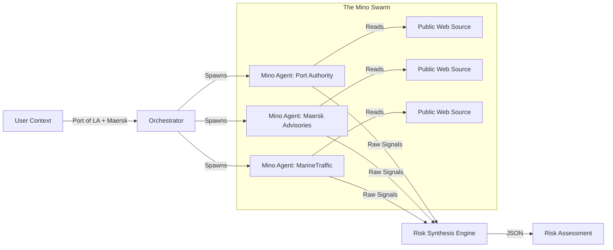
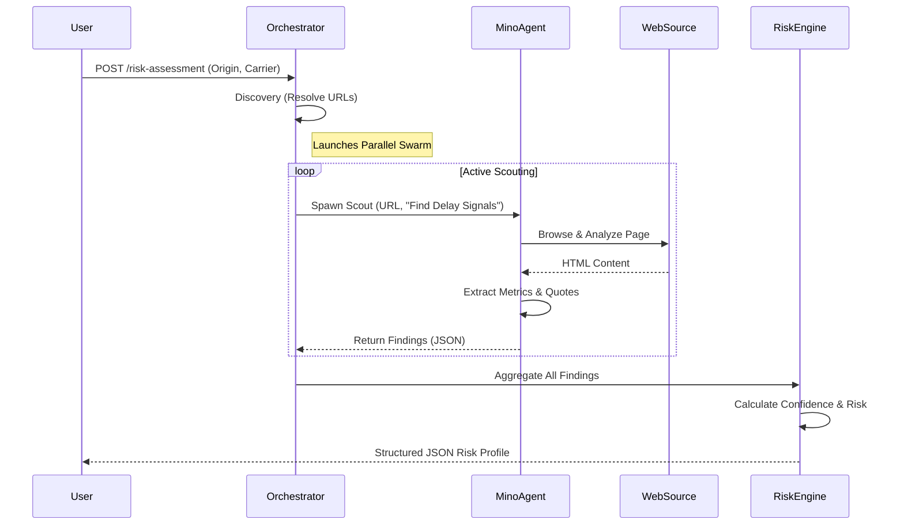
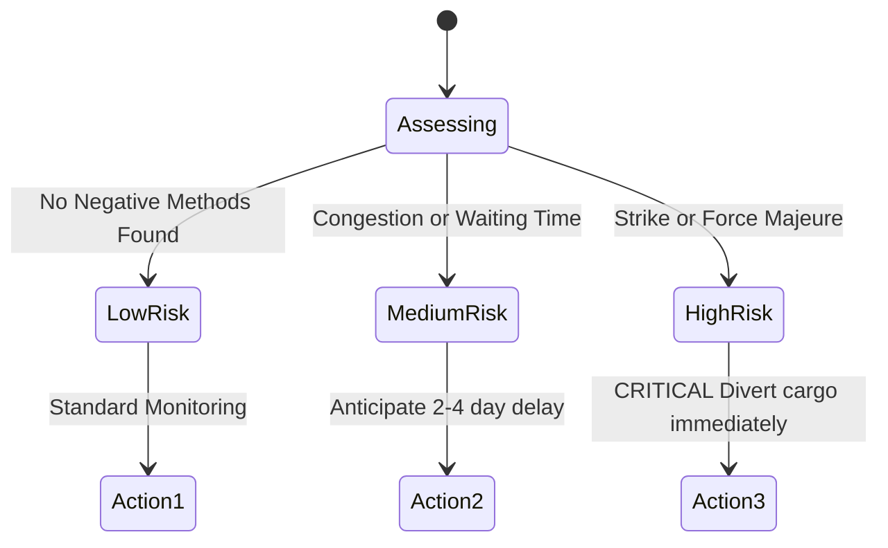

# Mino Logistics Intelligence: Autonomous Real-Time Risk Monitor

**Context-Aware Supply Chain Visibility**

This application is a next-generation logistics monitoring tool that uses the **Mino API** to deploy autonomous web agents. These agents "scout" disparate public data sources (Carrier Advisories, Port Terminal Statuses, Weather Bureaus) in real-time to detect delay risks that traditional APIs miss.

---

## 🏗 System Architecture: "The Swarm"

The tool operates on a **"Connect - Scout - Synthesize"** pipeline:



### 1. The Context Engine (Orchestrator)
Instead of hardcoded integrations, the system maps a shipment context (e.g., "Shanghai to Rotterdam via MSC") to a dynamic list of *intelligence targets*. It knows that for "Shanghai," it must check the *Shanghai International Port Group* website, and for "MSC," it must check the *MSC Customer Advisories* page.

### 2. The Mino Agents (Execution Layer)
This is where **Mino** plays a critical role. Traditional scraping is brittle and gets blocked. Mino Agents act like human analysts:
- **Autonomous Navigation**: They don't just download HTML; they "read" the page, identifying relevant sections like "Service Alerts" or "Operational Updates".
- **Deep Extraction**: They extract quantitative data (e.g., *"Wait time: 3 days"*) and qualitative statements (e.g., *"Terminal operating normally"*).
- **Parallelism**: The system launches 10+ agents simultaneously, turning a 30-minute manual check into a 10-second scan.

### 3. Risk Synthesis (Decision Layer)
A specialized logic engine normalizes the unstructured text from the web agents into a structured **Risk Profile**:
- **Risk Level**: LOW / MEDIUM / HIGH
- **Primary Cause**: Congestion, Labor Strike, Weather, Technical Outage
- **Confidence Score**: Based on the number of verified sources and the specificity of the data found.

---

## ⏱ Process Flow: "Connect & Scout"

The following diagram illustrates the lifecycle of a single Risk Assessment request. Note the parallel execution of the agent swarm.



---

## 🧠 Decision Logic: From Signals to Action

The system doesn't just pass through data; it reasons about it to determine the "Recommended Action".



---

## 🚀 Key Features

### "Deep Metrics" Extraction
The system doesn't just look for bad news. It verifies *health*. If a port status page says *"Gates open, zero wait time,"* the agent reports this as a verified **POSITIVE** signal, distinguishing "Safe" from "Unknown."

### Real-Time Visual Feedback
The dashboard features a "Network Scan" visualizer that shows the user exactly which nodes (URLs) are being interrogated at any given second, building trust in the autonomous process.

### Action-Oriented Recommendations
The output isn't just a list of problems. It provides specific operational advice:
- *Risk: HIGH (Labor)* -> **"Divert cargo immediately."**
- *Risk: MEDIUM (Congestion)* -> **"Anticipate 2-4 day slide."**
- *Risk: LOW* -> **"Continue monitor milestones."**

---

## 🛠 Tech Stack

- **Frontend**: Next.js 14, React, Tailwind CSS, Framer Motion (for "Swarm" visuals).
- **Backend API**: Next.js API Routes (Serverless).
- **Intelligence Core**: **Mino API** (Browser Automation & Reasoning).
- **Styling**: Lucide React Icons, "Glassmorphism" UI.

---

## 🏃‍♂️ Getting Started

1. **Clone & Install**
   ```bash
   git clone [repo]
   npm install
   ```

2. **Configure Mino**
   Get your API keys from [Mino.ai](https://mino.ai) and add them to `.env.local`:
   ```bash
   MINO_API_KEY=your_key_here
   ```

3. **Run the Monitor**
   ```bash
   npm run dev
   ```
   Open [http://localhost:3000](http://localhost:3000) and initiate a scan.
