# TinyFish - Logistics Intelligence Sentry
Live Demo: [https://inventory-agent-three.vercel.app/](https://inventory-agent-three.vercel.app/)

A comprehensive logistics intelligence platform that helps supply chain teams track port congestion, carrier advisories, and operational risks across multiple sources simultaneously. Uses the **Discovery → Scouting → Synthesis** pipeline pattern with parallel Mino browser agents to provide real-time, source-backed operational signals.


## Demo
<video controls src="20260128-0324-37.5637592.mp4" title="Title"></video>

## How Mino API is Used
The Mino API powers the core execution layer. The orchestrator deploys **multiple Mino Agents** to navigate the live DOM of target logistics sites, bypassing static API limitations. These agents extract "Deep Metrics" (wait times, vessel counts, specific alerts) and return structured operational signals.

## Code Snippet
```javascript
// Example: Requesting a Risk Assessment in the Logistics Sentry
const response = await fetch("/api/logistics/risk-assessment", {
  method: "POST",
  headers: { "Content-Type": "application/json" },
  body: JSON.stringify({
    origin_port: "Port of Los Angeles",
    carrier: "Maersk",
    mode: "Sea Freight"
  }),
});

const data = await response.json();
// Returns a structured Risk Profile with confidence scores and root causes
```

## How to Run
### Prerequisites
- Node.js 18+
- Mino API key (get from [mino.ai](https://mino.ai))

### Setup
1. **Clone the repository**:
   ```bash
   git clone https://github.com/manasmathur/Logistics-Sentry
   cd Logistics-Sentry
   ```
2. **Install dependencies**:
   ```bash
   npm install
   ```
3. **Configure Environment**:
   Create a `.env.local` file with:
   ```bash
   MINO_API_KEY=xxx
   ```
4. **Run development server**:
   ```bash
   npm run dev
   ```

## Architecture Diagram

```mermaid
graph TD
    UI[USER INTERFACE<br/>Next.js 14 + Framer Motion]
    API[Risk Orchestrator<br/>api/logistics/risk-assessment]
    
    Mino[MINO BROWSER AGENTS<br/>Execution Layer]
    Web[LIVE PUBLIC WEB<br/>Ports / Carriers / Alerts]
    Logic[RISK ENGINE<br/>Synthesis & Decisioning]
    
    UI -->|Route Context| API
    API -->|1. Discovery| API
    API -->|2. Parallel Swarm| Mino
    Mino -->|3. Scrape & Reason| Web
    Web -->|Unstructured Data| Mino
    Mino -->|Structured Signals| Logic
    Logic -->|JSON Risk Profile| API
    API -->|4. Assessment| UI
```

